# Feature Space Attack
> This is the official coder for paper  Xu et al. [Towards Feature Space Adversarial Attack](https://arxiv.org/abs/2004.12385). The code is developed on the basis from [Ye](https://github.com/elleryqueenhomels/arbitrary_style_transfer).

## Table of contents
* [Description](#description)
* [Adversarial Samples](#Adversarial-Samples)
* [Prerequisites](#Prerequisites)
* [Pretrained Model](#Pretrained-Model)
* [Tutorial](#Tutorial)
* [Result](#Result)
* [Features](#features)
* [Environment](#Environment)
* [Contact](#contact)
* [Citation](#Citation)

## Description
This project provides a general way to construct adversarial attack in feature space! Different from common works on pixel-space, in this project, we aimed to find a suitable feature space for adversarial attack.  With this spirit, we leverage style transfer and propose a two-phase feature-space attack. The first phase (a) is to ensure that feature-space perturbation can be restored back into pixel-space. The second phase (b) is to find such adversarial perturbation within a proper bound. 

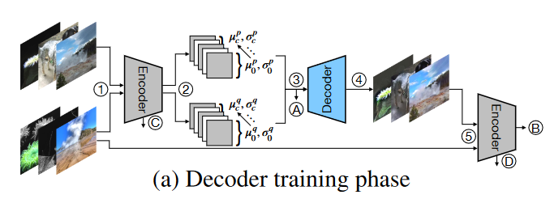

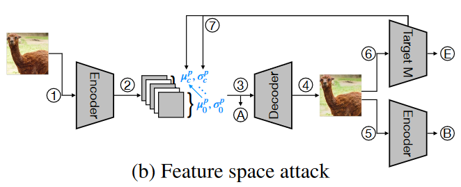

## Adversarial Samples

The first row is the benign image and the second row is the our adversarial samples. The last row visualizes their differences. Notice the difference can be categorized as color, texture and implicit style changes.

|          Espresso           |          Llama           | Printer                    | Guitar                             |
| :-------------------------: | :----------------------: | -------------------------- | ---------------------------------- |
| 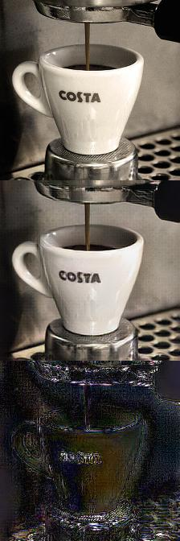 | 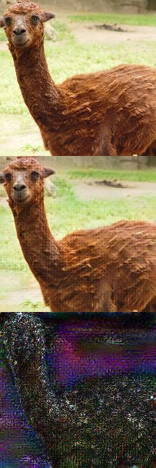 | 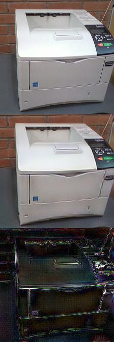 | 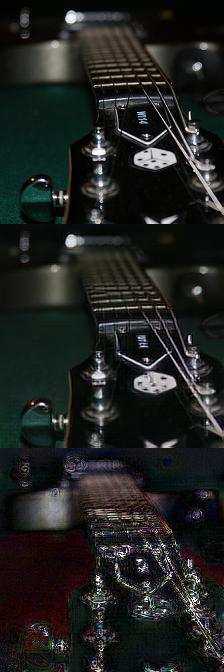 |

## Prerequisites
[ImageNet](http://www.image-net.org/) : Create subdirectories "imagenet", extract "train", "val" from ImageNet there.

[CIFAR10](https://www.cs.toronto.edu/~kriz/cifar.html) : Create subdirectories "cifar10_data", extract downloaded files there.

[VGG19]( https://qiulingxu-public.s3.us-east-2.amazonaws.com/FSA/vgg19_normalised.zip) : Extract it in the root

## Pre-trained Model

- [Pretrained Decoder for ImageNet](https://qiulingxu-public.s3.us-east-2.amazonaws.com/FSA/Imagenet_Decoder.zip)
- [Pretrained Decoder for CIFAR10](https://qiulingxu-public.s3.us-east-2.amazonaws.com/FSA/CIFAR10_Decoder.zip) 
- [Default Classifiers for Attack](https://qiulingxu-public.s3.us-east-2.amazonaws.com/FSA/Classifiers.zip)

 Download and extract them in the root directories or you can instead use your models.

## Tutorial

Two files are needed for performing the attack. If you already downloaded the pre-trained decoder. You can skip the step 1.

### Step 1: 

Run`python train.py --dataset="[dataset]" --decoder=[depth of decoder]`. 

A deeper decoder injects more harmful perturbation but is less nature-looking. The command looks like the follows: 

- `python train.py --dataset="imagenet" --decoder=3` 
- `python train.py --dataset="cifar10" --decoder=3 --scale`

### Step 2:

 Run  `python attack.py --dataset="[dataset]" --decoder=[depth of decoder] --model="[name of classifier]"` e.g.  

- `python attack.py --dataset="imagenet" --decoder=3 --model="imagenet_denoise"` 
- `python attack.py --dataset="cifar10" --decoder=3 --scale --model="cifar10_adv"`

Note that for CIFAR10 dataset, you need to choose whether to scale up the image size to match for VGG19's input.  Scaling up will increase the quality of attacks while consumes more memory. If you don't want to scale it up, remove the scale option and set decoder to 1 in the command.

The generated image can be found at "store" subdirectories.

## Result

### Accuracy under Attack

|                            |                            |
| -------------------------- | -------------------------- |
| 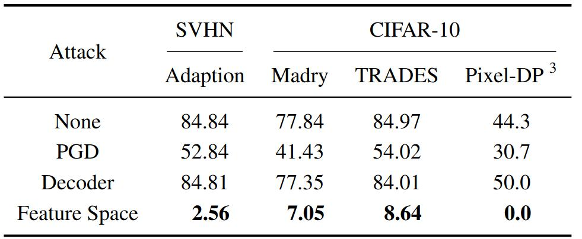 | 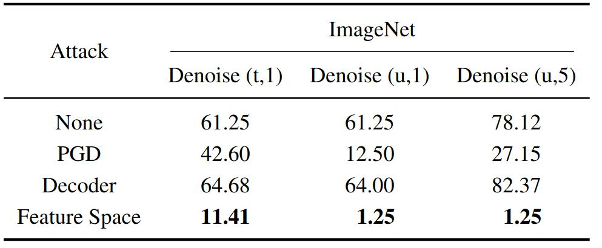 |

*The result shows that defense on pixel-space can hardly ensure robustness on feature space. We set decoder=1 for the smaller dataset in the first table, and set decoder=3 for Imagenet. We set the bound=1.5 for untargeted attack and 2 for targeted attack.*

### Human Preference Rate

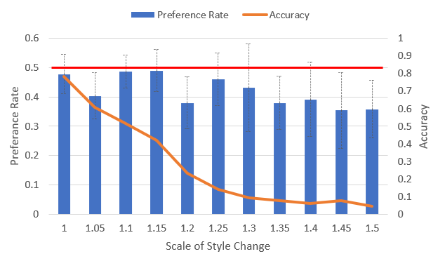

*We employ targeted attack on Imagenet Resnet50 v1 Model. We report the successful rate and corresponding human preference rate under different bound. We choose Imagenet and decoder=1 for this experiment.*

### Adversarial Training

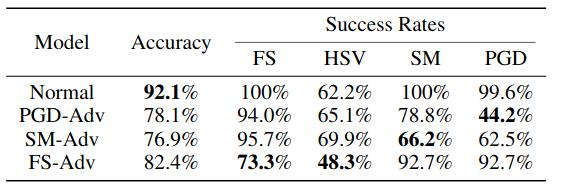

*The result shows that adversarial training on feature space or pixel-space is useful to related attacks, but not each other. Thus people need to consider both cases for well-round defenses.*

### Different Attacks

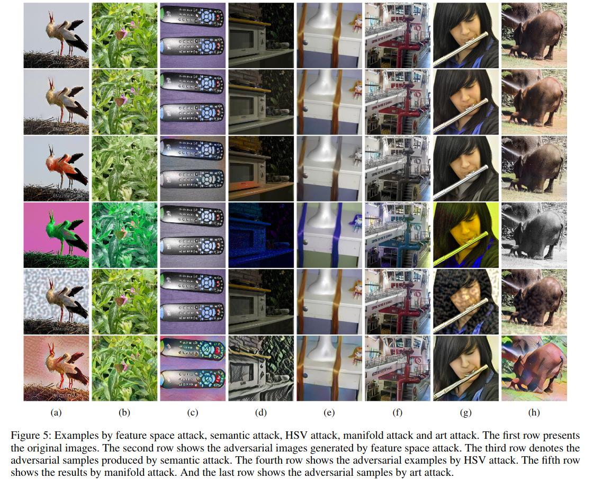

## Features

I reorganize the code for better structure. Let me know if you run into errors. Some of the function is not polished and not public yet.

* Implemented two phase algorithm
* Support for Feature Argumentation Attack

To-do list:
* Play and plug on any model
* Feature Interpolation Attack 

## Environment

- The code is tested on Python 3.6 + Tensorflow 1.15 + Tensorpack + Ubuntu 18.04
- We test the program on GTX 2080TI.  If you have a card with small memory, please consider decrease the "BATCH_SIZE" in "settings.py" .
- To setup the environment, please download the code and model here.

## Contact
Created by [@Qiuling Xu](https://www.cs.purdue.edu/homes/xu1230/) - feel free to contact me!

## Citation

>@misc{xu2020feature,
>
>title={Towards Feature Space Adversarial Attack}, 
>
>author={Qiuling Xu and Guanhong Tao and Siyuan Cheng and Lin Tan and Xiangyu Zhang},
>
>year={2020},
>
>eprint={2004.12385},
>
>archivePrefix={arXiv},
>
>primaryClass={cs.LG}
>}